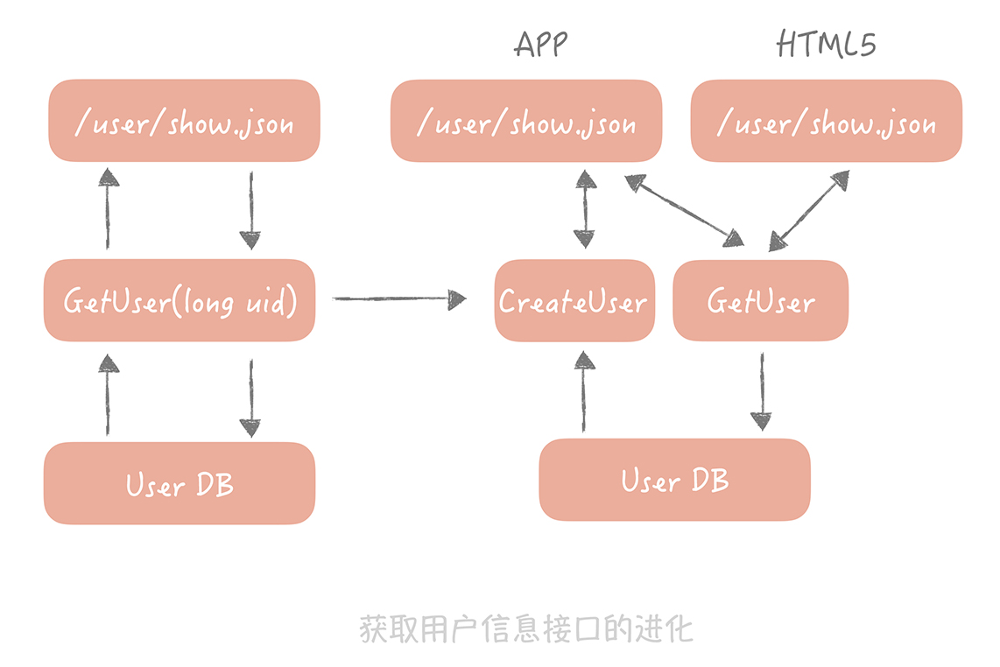

# 架构分层

## 什么是架构分层

-「MVC」（Model-View-Controller）架构。它将整体的系统分成了 Model（模型），View（视图）和 Controller（控制器）三个层次，也就是将用户视图和业务处理隔离开，并且通过控制器连接起来，很好地实现了 表现和逻辑的解耦，是一种标准的软件分层架构
- 另外一种常见的分层方式是将整体架构分为表现层、逻辑层和数据访问层：
    - 表现层，顾名思义嘛，就是展示数据结果和接受用户指令的，是最靠近用户的一层； 
    - 逻辑层里面有复杂业务的具体实现； 
    - 数据访问层则是主要处理和存储之间的交互。

## 分层的优势

- 有了分层的设计，你只需要专注设计应用层的程序就可以了
- 分层之后可以做到很高的复用
- 分层架构可以让我们更容易做横向扩展

**既然分层的架构可以为横向扩展提供便捷， 那么支撑高并发的系统一定是分层的系统**

# 如何来做系统分层

- 最主要的一点就是你需要理清楚，**每个层次的边界是什么**
- 当业务逻辑简单时，层次之间的边界的确清晰，但是当业务逻辑变得越来越复杂时，边界就会变的越来越模糊

任何一个系统中都有用户系统，最基本的接口是返回用户信息的接口，它调用逻辑层的`GetUser`方法，`GetUser`方法又和`User DB`交互获取数据，就像下图左边展示的样子。

这时，产品提出一个需求，在 APP 中展示用户信息的时候，**如果用户不存在，那么要自动给用户创建一个用户**。同时，要做一个 HTML5 的页面，HTML5 页面要保留之前的逻辑，也就是不需要创建用户。**这时逻辑层的边界就变得不清晰，表现层也承担了一部分的业务逻辑（将获取用户和创建用户接口编排起来）**。

参照阿里发布的《阿里巴巴 Java 开发手册 v1.4.0（详尽版）》 (opens new window)，我们可以将原先的三层架构细化成下面的样子：

其中每一层的作用：

- 终端显示层：各端模板渲染并执行显示的层。当前主要是 Velocity 渲染，JS 渲染， JSP 渲染，移动端展示等。
- 开放接口层：将 Service 层方法封装成开放接口，同时进行网关安全控制和流量控制等。
- Web层：主要是对访问控制进行转发，各类基本参数校验，或者不复用的业务简单处理等。
- Service层：业务逻辑层。
- Manager层：通用业务处理层。这一层主要有两个作用：
  - 你可以将原先 Service 层的一些通用能力下沉到这一层，比如与**缓存和存储交互策略**，中间件的接入；
  - 你也可以在这一层**封装对第三方接口的调用，比如调用支付服务，调用审核服务**等。
- DAO层：数据访问层，与底层 MySQL、Oracle、Hbase 等进行数据交互。
- 外部接口或第三方平台：包括其它部门 RPC 开放接口，基础平台，其它公司的 HTTP 接口。

在这个分层架构中，**主要增加了`Manager层`**，与`Service层`的关系是：**`Manager层`提供原子的服务接口**，**`Service层`负责依据业务逻辑来编排原子接口**

以上面的例子来说，`Manager`层提供**创建用户**和**获取用户信息**的接口，而`Service层`负责将这两个接口组装起来。这样就把原先散布在表现层的业务逻辑都统一到了`Service层`，每一层的边界就非常清晰了。

分层架构需要考虑的另一个因素，是**层次之间一定是相邻层互相依赖，数据的流转也只能在相邻的两层之间流转**。
